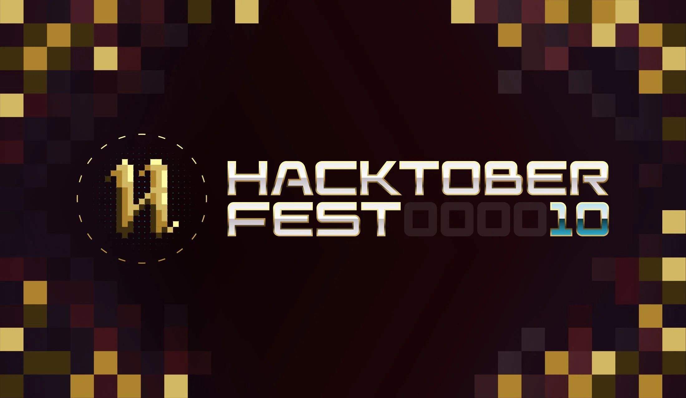

# 💛🎯 HacktoberFest 2023 💛🎯
#### CELEBRATING 10TH YEAR OF OPEN SOURCE!
# Contribute to open source and Earn Digital Rewards 🚀
#### Star & fork this Repo first 


Use this project to make your contributions to open source during HacktoberFest 2023. Practice making your pull requests to public repositories before doing the real thing! 
This repository is open to all members of the GitHub community. Any member may contribute to this project without being a collaborator.

## What is Hacktoberfest?
Hacktoberfest is an annual event that runs throughout October, sponsored by [Digital Ocean](https://hacktoberfest.digitalocean.com/) and [GitHub](https://github.com/blog/2433-celebrate-open-source-this-october-with-hacktoberfest), to encourage contributions to open source projects.
[Hacktoberfest Official Website](https://hacktoberfest.com/)

# How to contribute to this project
### Video tutorials:
- [Hacktoberfest Official Website](https://hacktoberfest.com/)
- [Complete Hacktoberfest Pack](https://www.youtube.com/watch?v=K5nzruz1FpA&list=PLseEp7p6EwiZgLPknY4ITJxfoo75wqxph)
- [How to Do Your First Pull Request](https://www.youtube.com/watch?v=nkuYH40cjo4)
- [Resolving Merge Conflict](https://www.youtube.com/watch?v=kBIMGOxqqnk&t=207s)

### For Beginners
1) Visit & Learn   [Tutorial Github](https://www.youtube.com/playlist?list=PL4cUxeGkcC9goXbgTDQ0n_4TBzOO0ocPR)
2) Clone this repo
3) Make a pull request
4) Wait until your pull request is merged/given accepted tag

## Enjoy, and be a part of open source 🚀🥳

## Getting started
* Fork this repository (Click the Fork button in the top right of this page, click your Profile Image)
* Clone your fork down to your local machine

```markdown
git clone https://github.com/TAbhay/Hacktoberfest-2023.git
Create a branch
markdown
Copy code
git checkout -b branch-name
Make your changes (choose from any task below)
Commit and push
markdown
Copy code
git add .
git commit -m 'Commit message'
git push origin branch-name
Star this repository
Create a new pull request from your forked repository (Click the New Pull Request button located at the top of your repo)
Wait for your PR review and merge approval!
Tasks
1. Add your name
Add your name to the Profile.md file using the below convention:

Name	Bio	Github
Your_Name	Coder, Developer ..	https://github.com/username
2. Add a profile page
[🔗] Best Readme Generator
Add a Your_Name.md file to the profiles directory. Use any combination of content and Markdown you'd like. Here is an example:

Copy code
| Name | Location | Academics | Interests | Development |Projects |Profile Link|
3. Create a Hello, World! Script
Add a hello_world_yourusername.xx script to the scripts directory in any language of your choice! Here is an example:

Javascript
Copy code
// LANGUAGE: Javascript
// ENV: Node.js
// AUTHOR: Alice Chuang
// GITHUB: https://github.com/AliceWonderland

console.log('Hello, World!');
3. Add CODE|PROJECT|SNIPPETS
Add a directory inside Resources directory and add whatever resources you want to share.
It may be some algorithms, projects, or snippets.

Add sub-folders of your name and put files into respective sub-folders
Example - >
scss
Copy code
project
│   README.md
│   file001.txt    
│
└───folder1
│   └───subfolder1(your name + github id( optional ))
│       │   file111.cpp
│       │   file112.js
│       │   ...
│   
└───folder2
Hacktoberfest Participation

Reference links
Git branching : [https://learngitbranching.js.org/]
Creating awesome readme Online : https://dillinger.io/
Managing Forked Repos: https://help.github.com/articles/fork-a-repo/
Syncing a Fork repo: https://help.github.com/articles/syncing-a-fork/
Checkout this list for README examples - Awesome README Awesome
Github-Flavored Markdown https://guides.github.com/features/mastering-markdown/